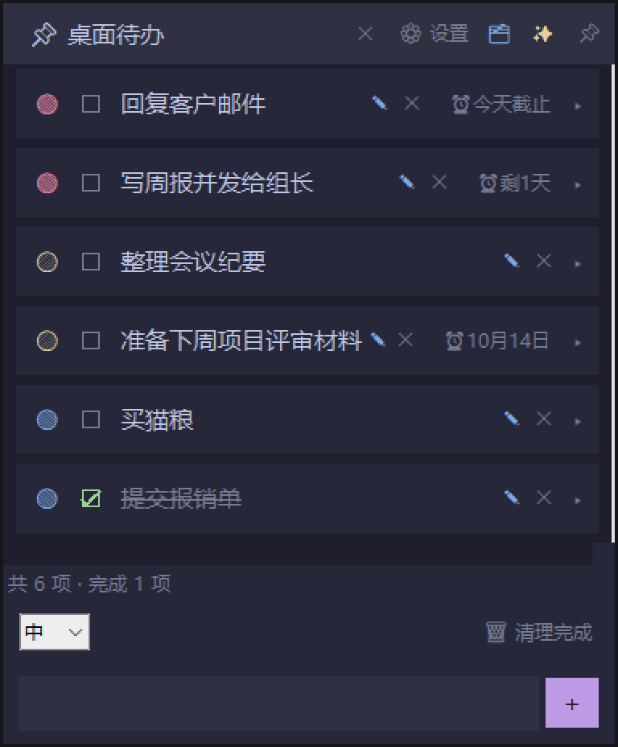

# 桌面待办 · Desktop Todo

一个常驻桌面的浮窗待办清单。置顶、半透明、无边框，随时看得见，随手就能勾。

Python + tkinter 写的，**单文件、零第三方依赖**，装好 Python 双击就跑。



## 功能

**基础**
- 置顶 / 半透明 (0.92) / 无边框 / 标题栏拖拽 / 右下角缩放
- 任务：添加、编辑、删除、勾选完成（右键菜单）
- 优先级 高 / 中 / 低（红 / 黄 / 蓝圆点）
- 开始日期 + 截止日期，自动生成到期提醒：`今天开始` / `X天后开始` / `今天截止` / `剩X天` / `逾期X天`
- 按优先级排序，已完成自动沉底；鼠标滚轮滚动
- 底部状态栏：`共 N 项 · 完成 M 项`

**✨ AI 自动整理**
- 把一段原始信息（会议纪要、聊天记录、邮件原文、随手记）粘贴进去，点「整理」
- 自动提取出里面的**任务**和**安排类事项**，并给出 高 / 中 / 低 优先级
- 支持三种模式：只生成新任务 / 重新评估现有任务优先级 / 两者都要
- 可指定「任务归属人」，只提取与这个人相关的部分
- 需要 DeepSeek API Key（见下方），不配置的话基础功能完全不受影响

## 快速开始

1. 装 [Python 3.8+](https://www.python.org/downloads/)（Windows 安装时记得勾 **Add Python to PATH**）
2. 下载本仓库全部文件
3. 双击 `启动桌面待办.bat`

也可以手动跑：

```bash
pythonw todo_desktop.py
```

任务数据存在同目录的 `tasks.json` 里，纯本地，不上传任何地方。

### 启用 AI 自动整理（可选）

需要一个 DeepSeek API Key。设置环境变量即可：

```bash
setx DEEPSEEK_API_KEY "sk-你的key"
```

或者写进 `~/.dsh/.credentials.yaml`：

```yaml
DEEPSEEK_API_KEY: sk-你的key
```

没配 key 也能正常用，只是「✨ AI 自动整理」按钮点了会提示缺 key。

## 为什么做这个

桌面待办工具用了一圈，要么太重、要么要联网、要么弹窗干扰。想要的是那种「**一直在那里，但不烦你**」的感觉——所以做成半透明置顶浮窗，不抢焦点，抬眼就能看到今天还剩什么。

## Roadmap

- [ ] 自动检测工作内容并收集（不用手动粘贴，自动把当天的工作沉淀成待办）
- [ ] 界面改版
- [ ] 打一个免装 Python 的 exe

## 反馈

有 bug 或者想要什么功能，直接开 [Issue](../../issues)。说清楚你的使用场景比说"不好用"有用得多，谢啦。

## 说明

代码版权归作者所有，欢迎试用和反馈。暂未指定开源协议。
